## 编译与运行

### 简单的编译和运行

要把写好的`hello.c`跑起来，首先得把它变成可执行的程序，这个过程叫做**编译**（Compiling）。

编译的结果是一个可执行程序，在Windows下，一般是一个`.exe`文件；
在Linux下，则是一个不需要后缀名的可执行文件（其文件属性的`x`字段为true）。
本书里为了统一，都加上`.exe`后缀名。

我们写的`hello.c`只能在命令行打印`Hello World!`的信息，因此需要在命令行里运行它。

在Linux的bash命令行环境下，编译和运行的过程如下：

```bash
bash> ls
hello.c
bash> cc -o hello.exe hello.c
bash> ls
hello.c hello.exe
bash> ./hello.exe
Hello World!
```

我们调用编译器命令`cc`来编译C语言程序。

`cc`（C Compiler）只是一个别名，它实际上是`gcc`的一个软链接（symlink）。
如果想换成`clang`或`tcc`等其他的C语言编译器，可以把`cc`指向`clang`或`tcc`。

例如，在Ubuntu 18.04下，可以这样做：

```bash
bash> sudo ln -sf /usr/bin/clang /usr/bin/cc
```

`cc`命令的参数`-o`意思是`output`，即输出文件的名称，这里我们给定了`hello.exe`。
如果不给定，依照传统惯例，默认的输出文件名是`a.out`。

编译后得到的`hello.exe`文件，就是一个可执行程序，可以直接在命令行里用`./hello.xe`的方式运行。
运行的结果是在命令行里打印出"Hello World!"。

在Windows下，可以在`cmd`里直接输入`hello.exe`来执行，也可以在文件浏览器里直接双击运行。
但需要注意的是，由于我们的程序输出文字之后就退出了，所以双击看到的就是一闪而过的窗口而已。
要想让窗口停下来，还得在代码里加上其他的函数进行等待，具体后面会涉及到。


### 选择编译器

我们的示例用的`cc`命令实际上是`gcc`编译器（GNU C Compiler）。

除了`gcc`之外，还有三个C编译器值得关注：

- `clang`：基于LLVM生态的C/C++编译器。架构清晰、模块整洁、性能优秀。
- `tcc`：Tiny C Compiler。大神Bellard的作品，超级小巧，编译速度巨快（据说至今仍然是编译最快的C编译器），以至于可以当做C语言解释器来用。
- `msvc`：微软的C/C++编译器。Visual Studio的默认编译器。在Windows下开发C/C++，基本上绕不开他。

#### gcc

`gcc`是Linux环境下最常见的编译器，它是GNU自由软件项目的一部分，因此大部分Linux系统都会自带`gcc`。

对于C或C++的程序员来说，第一个学习的编译器往往都是`gcc`。
`gcc`的编译和优化都做得不错，用来作为编译工具是十分合格的。
但GCC历史悠久，包袱较重，项目代码量巨大（据说有1500万行），且内部模块划分并不清晰，相互之间依赖严重，并不适合初学者拿来作为学习编译原理的工具。

在我使用的`Ubuntu`或`DeepinOS`中，`gcc`基本不用安装，系统自带。不过出于方便考虑，可以用`apt`来安装`gcc`及相关的编译工具：

```bash
bash> sudo apt install build-essential
```

`build-essential`是一个集合安装包，它包括`gcc`、`g++`、`make`、`libc`等工具。

#### clang

`clang`是LLVM生态中的C/C++前端。相对于GCC来说比较年轻，历史包袱也比较小。

LLVM项目是一个巨大的编译器开发生态，它设计了一套通用的中间代码（LLIR），并提供了前端和后端的模块接口。这样，可以使用不同的前端来解析不同的语言代码，生成LLIR，再调用所需的后端生成对应环境的目标代码。例如，`clang`就是LLVM官方提供的`C/C++`语言前端，它可以将`C/C++`代码编译成LLIR，然后再调用LLVM提供的后端生成`x86`、`ARM`、`MIPS`等不同架构的机器码。

而我常用的Ubuntu所用的后端架构是`x86_64 Linux`。

Clang/LLVM的设计更加模块化，也更加易于扩展。用来学习编译技术非常合适，因此很多新语言都是在LLVM平台上模仿Clang实现的，例如Rust、Julia等。

在`Ubuntu`或`DeepinOS`中，可以用`apt`来安装`clang`：

```bash
bash> sudo apt install clang
```

Clang/LLVM

#### tcc

相对于`gcc`和`clang`，`tcc`可以算是超轻量级的C编译器了。最新版的`tcc`只有10万行左右代码，完整的编译器程序，包括预处理、链接器和内存安全检查器，总共只有100多K大小。
因此`tcc`常用于对资源要求比较严苛的嵌入式系统中，或者作为启动盘的一部分。

`tcc`支持C99标准。`tcc`的编译速度超快，至少比`gcc`快3倍。

`tcc`和`gcc`、`clang`还有一个重要的区别，就是它只支持C语言，而不支持C++。

对我而言，这是优点。我暂时只考虑学习C语言，而C++过于复杂了，并不适合作为研究编程语言的对象。

因此，未来需要深入研究C编译器内部原理的时候，没有C++干扰的`tcc`显然比`clang`和`gcc`更为合适。

并且，由于代码量少，结构清晰，`tcc`的代码本身也是一份很优秀的学习材料。未来我会专门去研究它（以及类似的小型C编译器，如`chibicc`、`lcc`等）。

要使用`tcc`，可以用`apt`来安装：

```bash
bash> sudo apt install tcc
```

#### msvc

网上很多老教程都是基于`msvc`（尤其是老版的`VC6.0`），其实我感觉已经有些过时了。
尤其新版的Visual Studio主推C++，甚至不单独支持C的文件，而只能把C作为C++的一个子集来用。
再考虑到`msvc`只适合Windows平台，我不推荐使用它。如果是学习C++，尤其是Windows擅长的C++游戏编程，倒是可以考虑。

`msvc`一般不单独使用，而是直接下载`Visual Studio`即可。它有免费的社区版，可以在[这里](https://visualstudio.microsoft.com/vs/community/)下载。

Visual Studio的开发流程一般都不涉及命令行，因此和Linux下的开发流程不同。等需要用它的时候我再记录吧。

### 可执行文件

有时候我会好奇，到底什么是可执行文件呢？为什么直接双击或者`./<file>`它就可以运行？操作系统又是怎么与它交互的？

查找资料后发下你，所谓可执行文件，也还是一种特殊的代码文件，只不过我们写的代码是文本的，而这种文件的代码是二进制的机器码。

操作系统将这段机器码直接加载到内存里，并找到它的入口指令，然后就可以一条条指令地执行了。

那么这种二进制文件具体是什么格式呢？我在这里稍微记录一下。

它是更贴近系统底层的机器码，而汇编语言正是与机器码一一对应的文本形式，以供人去读写。
因此关于二进制格式的更详细的探讨，我打算另开一本书[《脚踏实地汇编语言》](https://gitee.com/jiaota/jiaota-assembly)来记录。
详情可以到那本书去细看。

二进制文件的内容主要就是机器码，而不同的架构的机器码也是不同的。另外，二进制文件由操作系统载入并执行，而各个操作系统在设计之初并没有为此约定标准，因此Linux、Windows、MacOS等操作系统的二进制文件格式也是不同的。

- Linux下的可执行二进制文件，格式是[`ELF`](https://en.wikipedia.org/wiki/Executable_and_Linkable_Format)（Executable and Linkable Format）。
- Windows下的可执行文件（即`.exe`），格式是[`PE`](https://en.wikipedia.org/wiki/Portable_Executable)（Portable Executable）。
- MacOS下的可执行文件，格式是[`Mach-O`](https://en.wikipedia.org/wiki/Mach-O)（Mach Object）。

还有一些其他的格式，可以参见[这里](https://en.wikipedia.org/wiki/Comparison_of_executable_file_formats)的对比。

总的来说，这三种格式都是结构化的，将一个文件分为不同的部分，分别用来存放二进制代码（code）、二进制数据（date）以及其他的一些信息（symbol table、debug info等，统称为meta）。

这三种不同格式的主要区别就是不同部分的定义、名称和格式有细微区别。总体而言，随着时代的发展，他们三者的功能已经越来越接近了。

这三者之中，`ELF`一开始就是为了通用性而设计的格式，因此它的应用范围也最广泛。比如，Android、PlayStation这些耳熟能详的系统，用的也是`ELF`格式。

因此我就只介绍`ELF`格式，其他以后有需要的时候再补充。

#### ELF格式

我们在Linux下生成的`hello.exe`文件就是一个`ELF`格式的二进制可执行文件。

我们可以用`file`命令来查看一个文件的具体格式：

```bash
bash> file hello.exe
hello.exe: ELF 64-bit LSB executable, x86-64, version 1 (SYSV), dynamically linked (uses shared libs), for GNU/Linux 2.6.32, BuildID[sha1]=0d515023c156fe158cca3be209a14ff5924814e1, not stripped
```

对比一下`file.c`：

```bash
bash> file file.c
file.c: C source, ASCII text
```

可以看到，`hello.exe`的格式是`ELF`，而`file.c`的格式是`ASCII text`。其他更复杂的信息与操作系统有关，就不赘述了。

ELF是一个复合的模式，它由三部分组成：

- ELF header，是整个文件的开头，用来描述整个文件的结构。
- Data，数据部分，包含了程序的代码和数据。
  - Program header，描述程序各个segment的信息，操作系统在加载程序时按照这里的描述，把各个segment的内容加载到内存中，再开始执行。
  - Section header，和Program不同，这里的信息用来具体描述各个section的内容，它主要是用来给动态链接器用的。
  - 一系列具体的section，用来存放不同类型的数据。几个相关的section组成一个segment
    - .text，这种section里存放的是程序的代码，即二进制机器码
    - .data，这种section里存放的是程序的数据，即全局变量
    - .rodata，这种section里存放的是只读数据，即常量
    - 其他类型的section

ELF文件的结构如下图所示：




看不太懂不要紧，因为我们大概知道它是干什么的就行了。

三个Header用来存储索引信息，而后面的各个section存放具体的代码和数据。
操作系统通过读取`Program Header`来决定怎么去执行具体的代码；链接器读取`Section Header`来决定怎么去链接具体的代码。
至于链接器相关的内容，等后面我们遇到多个程序文件配合时，才会涉及到。这里先忽略即可。

总之，可执行文件并不只是一条条指令排开，而是有一定结构的，这些结构和信息可以帮助操作系统来执行它。
也就是说，可执行文件就是“一系列的机器码指令和二进制数据按照某种格式约定的组合”。

更多详细信息，可以参考这几篇文章：

- [视频：ELF文件格式]：(https://www.bilibili.com/video/BV1u54y1Q7qf)
- [ELF文件格式](https://www.cnblogs.com/gatsby123/p/9750187.html)
- [What Is an ELF File?](https://www.baeldung.com/linux/executable-and-linkable-format-file)
- [Understanding ELF, the Executable and Linkable Format](https://www.opensourceforu.com/2020/02/understanding-elf-the-executable-and-linkable-format/)

### 汇编

`gcc`除了直接生成可执行文件，也可以生成对应的汇编代码文件，这样我们就可以大致了解对应的可执行文件的结构了。

#### gcc生成汇编

```bash
bash> gcc -S hello.c
```

`-S`参数告诉`gcc`我要的是汇编文件，这样就会生成一个`hello.s`文件，内容如下：

```assembly
	.file	"hello.c"
	.section	.rodata
.LC0:
	.string	"Hello World!"
	.text
	.globl	main
	.type	main, @function
main:
.LFB0:
	.cfi_startproc
	pushq	%rbp
	.cfi_def_cfa_offset 16
	.cfi_offset 6, -16
	movq	%rsp, %rbp
	.cfi_def_cfa_register 6
	movl	$.LC0, %edi
	call	puts
	movl	$0, %eax
	popq	%rbp
	.cfi_def_cfa 7, 8
	ret
	.cfi_endproc
.LFE0:
	.size	main, .-main
	.ident	"GCC: (GNU) 4.8.5 20150623 (Red Hat 4.8.5-44)"
	.section	.note.GNU-stack,"",@progbits
```

这里`.file`是整个文件的配置信息，类似于`ELF Header`。

`.section`显然是一段section的开头。

```assembly
.section .rodata
.LC0:
    .string "Hello World!"
```

这是一个section，格式为`.rodata`，即只读数据，内容是`.string "Hello World!"`。这里的`.LC0`是汇编的标签，用来在后面引用它，至于为啥叫`.LC0`我就不知道了。 

下一个section是`.text`，即程序的代码，内容是`main`函数的汇编代码。上面的代码一直到最后一行`.section`之前都是`main`函数的汇编代码。

`main`函数里的两句关键代码，分别对应的汇编如下：

- `printf("Hello World!\n");`

这一句对应于：

```assembly
movl	$.LC0, %edi ;; 将.LC0对应的字符串地址放到edi寄存器中
call	puts ;; 调用puts函数
```

为什么不是调用`printf`呢？这是编译器优化的结果。`gcc`发现我们调用的`printf`里其实并没有指定格式参数，所以就改用了更简单更快的`puts`函数。

- `return 0;`

这一句对应于：

```assembly
movl	$0, %eax ;; 将0放到eax寄存器中
ret ;; 返回
```

可以看到，我们的Hello World程序里，关键的两个section就是`.text`（对应main函数的代码）和`.rodata`（对应常量"Hello World"）。

另外，除了让`gcc`生成汇编，我们也可以直接观察`hello.exe`对应的汇编。

#### 用objdump查看ELF文件的汇编

ELF格式的文件并不容易观察，我们可以用`objdump`命令来查看它的汇编代码：

```bash
bash> objdump -d hello.exe
```

这回输出一大堆东西，因为我们的程序虽然只有两行，但是调用了C标准库，所以生成的执行代码里还得包含如何去寻找标准库函数的部分。

对于我们的`main`函数，只需要关注其中的`.main`一段即可：

```
000000000040052d <main>:
  40052d:	55                   	push   %rbp
  40052e:	48 89 e5             	mov    %rsp,%rbp
  400531:	bf e0 05 40 00       	mov    $0x4005e0,%edi
  400536:	e8 d5 fe ff ff       	callq  400410 <puts@plt>
  40053b:	b8 00 00 00 00       	mov    $0x0,%eax
  400540:	5d                   	pop    %rbp
  400541:	c3                   	retq   
  400542:	66 2e 0f 1f 84 00 00 	nopw   %cs:0x0(%rax,%rax,1)
  400549:	00 00 00 
  40054c:	0f 1f 40 00          	nopl   0x0(%rax)
```

这里关键的两段汇编如下：

```assembly
mov $0x4005e0,%edi
callq 400410 <puts@plt>
```

这里是调用`puts`函数的意思。
调用的参数是`0x4005e0`，这是一个地址，它指向的正是"Hello, world!"这个字符串。

```assembly
mov $0x0,$eax
retq
```

这里是`return 0`的意思。

至于这些汇编的具体情况，我们现在也不用掌握，大概知道他们是干什么的就行了。

想对汇编有更多了解，可以参看[《脚踏实地汇编语言》](https://gitee.com/jiaota/jiaota-assembly)一书。

#### 小结

总体来说，对我这样的普通程序员而言，这两个编译器用起来区别不大，对C/C++的标准更新都很快，编译出来的代码运行速度也都很快，可以说介于伯仲之间。

如果想深入学习C/C++的编译技术，则模块化更好、架构更清晰的Clang/LLVM则是更好的选择。

本书中出于方便，我就直接采用`cc`的默认选择`gcc`来编译C程序了。未来在探讨编译器设计原理的时候，我们大概率会讨论到`clang`。


